# TileGraphAgent CesiumJS Viewer — Architecture Reference

> **Audience:** Engineers joining the project. Assumes familiarity with CesiumJS, 3D Tiles, Cloudflare, and Neo4j. This document describes what is built, how it works internally, and what is missing.

---

## 1. Overview

`tilegraphviewer` is a single-page CesiumJS application that serves as the **industrial visualization surface** for the TileGraphAgent platform. It is not a generic 3D renderer. It is purpose-built to stream geometry from a 3D Tiles pipeline, map visual features back to engineering objects with stable identities, receive AI-issued commands from the Worker HTTP API, and surface engineering metadata to operators and LLM agents.

### Core Thesis

> The viewer is not a generic 3D renderer. It is an industrial engineering visualization surface built on top of CesiumJS and connected to graph-aware AI workflows.

The central architectural concern is **object identity preservation**. Every triangle rendered in the scene must be traceable back to an `object_id` — a deterministic SHA-256-derived identifier that is shared across the Rust pipeline, the Neo4j graph, the spatial index, and the 3D Tiles feature metadata. The viewer is the terminal point of this identity chain: it receives `object_id` from picked features, requests properties from Neo4j via the Worker, and receives commands targeting `object_id` lists from the MCP agent.

### Platform Position

| System | Role relative to viewer |
|--------|------------------------|
| Rust pipeline | Produces the geometry and identity mappings the viewer consumes |
| Cloudflare Pages static assets | Serves `public/data/tiles/tileset.json` and `*.glb` directly to CesiumJS as `/data/tiles/...` |
| Cloudflare R2 | Stores Worker-side platform artifacts such as audit logs and spatial indexes |
| Cloudflare Worker (`tilegraphmcp`) | Serves REST API, chat stream, and viewer command queue |
| Neo4j Aura | Source of engineering property data, queried through the Worker |
| LLM Agent (Claude) | Issues commands to the viewer through Worker HTTP command state |

---

## 2. Responsibilities

### What the Viewer SHOULD Do

- Stream 3D Tiles (hierarchical GLBs) from `/data/tiles`, served from `public/data/tiles`
- Render industrial plant geometry in a CesiumJS scene
- Perform feature picking on LEFT_CLICK, resolving `feature_id` → `object_id`
- Display engineering properties for picked objects (tag, class, status, fluid, design parameters)
- Receive and execute viewer commands from the MCP agent via HTTP command polling
- Highlight sets of engineering objects by `object_id`
- Isolate (show-only) sets of engineering objects by `object_id`
- Display the engineering model tree hierarchy (Area → System → Line → Equipment)
- Display the agent audit log for transparency
- Forward user questions to the agent loop via `POST /chat` SSE stream

### What the Viewer MUST NOT Do

- Execute graph traversal (that belongs to the Worker/MCP tools)
- Query Neo4j directly (the Worker is the only graph client)
- Generate engineering conclusions (that is the agent's role)
- Generate geometry or produce 3D Tiles (that is the Rust pipeline's role)
- Perform spatial indexing queries (the Worker reads `spatial_index.json` from R2)
- Perform agent reasoning (the Claude API call happens in the Worker, not the browser)

---

## 3. Position Inside Platform

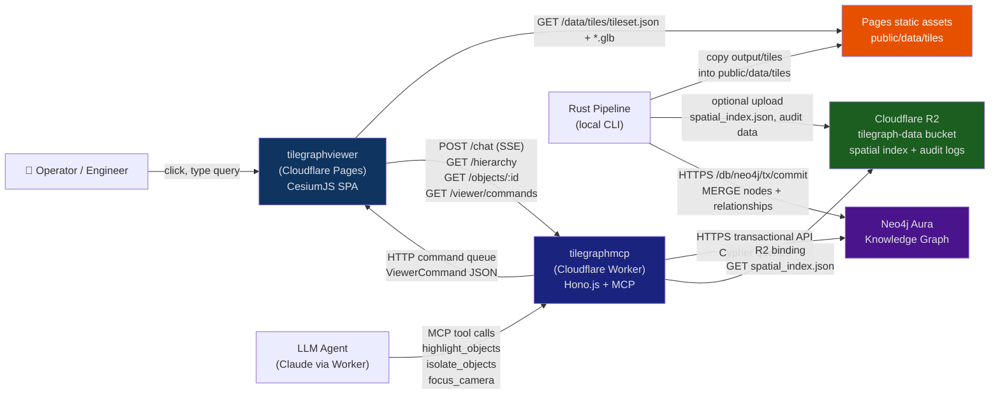

**Geometry flow:** `Pipeline → public/data/tiles → Viewer (CesiumJS stream)`  
**Metadata flow:** `User click → Viewer → Worker → Neo4j → Worker → Viewer`  
**Command flow:** `User query → Viewer → Worker → Agent → Worker command queue → Viewer poll`  
**Viewer event flow:** `Viewer pick → store update → properties panel render`

---

## 4. Deployment Architecture

### Production Topology

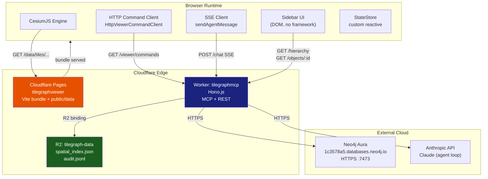

### Cloudflare Pages

| Setting | Value |
|---------|-------|
| Framework preset | None (Vite) |
| Build command | `npm run build` |
| Build output | `dist/` |
| Root directory | `apps/tilegraphviewer` |
| Node.js version | 20 |

The default tileset path is not an environment variable. The viewer always requests `/data/tiles/tileset.json`, which Vite and Cloudflare Pages serve from `public/data/tiles/tileset.json`.

Environment variables injected at build time by Vite (`import.meta.env`):

| Variable | Production value |
|----------|-----------------|
| `VITE_MCP_REST_URL` | `https://tilegraphmcp.quatricmorph.workers.dev` |

### Static Tile Data

The viewer serves tile geometry as Cloudflare Pages static assets. CesiumJS fetches directly from the same origin, so no tile-specific CORS configuration is required.

```
public/data/
  tiles/
    tileset.json              ← 3D Tiles 1.1 root manifest
    content/
      area-a-piping.glb
      area-a-equipment.glb
      area-a-support.glb
      area-a-cable.glb
      area-b-piping.glb
      ...
    metadata/
      tile_feature_map.json   ← feature_id → object_id mapping
    index/
      spatial_index.json      ← R-tree records
  reports/
    audit.jsonl               ← MCP tool audit log copy, if exported to Pages
```

The Worker may still use R2 bindings for server-side platform artifacts such as `spatial_index.json` and append-only audit logs. That path is separate from the viewer's default CesiumJS tile stream.

### Build Pipeline

```
src/
  main.ts              (entry point, DOM wiring)
  viewer/
    cesium_init.ts     (CesiumJS lifecycle + picking)
  agent/
    http_command_client.ts (HTTP command polling receiver)
    claude_client.ts   (SSE agent stream client)
  api.ts               (Worker REST base URL helper)
  state/
    store.ts           (custom reactive store)
  ui/
    model_tree.ts      (hierarchy panel)
    properties_panel.ts (selection properties)

↓ tsc (type check) + vite build (bundle with vite-plugin-cesium)

dist/
  index.html
  assets/             (JS chunks, Cesium assets)
  data/               (copied from public/data)
```

`vite-plugin-cesium` handles the non-trivial Cesium build requirements: it copies the Cesium static assets (Workers, image, terrain) into the output and configures `CESIUM_BASE_URL`.

---

## 5. Viewer Architecture

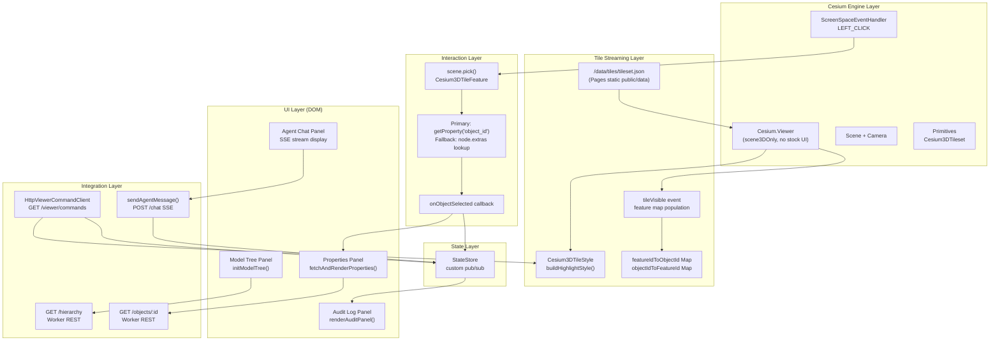

---

## 6. State Management Architecture

The viewer uses a **custom minimal pub/sub store** (`src/state/store.ts`). There is no Zustand, Redux, React Context, or Signals. The store is a plain TypeScript class holding a single `ViewerState` object.

```typescript
interface ViewerState {
  selectedObjectId: string | null;      // currently picked object
  selectedTag: string | null;           // engineering tag of picked object
  highlightedObjectIds: Set<string>;    // set highlighted by agent
  isolatedObjectIds: Set<string> | null; // null = no isolation active
  agentChatMessages: ChatMessage[];     // conversation history (in state, not used by DOM path)
  auditLog: AuditEntry[];               // last N MCP tool calls
  isAgentProcessing: boolean;           // disables submit button during streaming
}
```

The store exposes `get()`, `update(patch)`, and `subscribe(fn)`. Subscribers receive the full state on every update.

### State Transitions

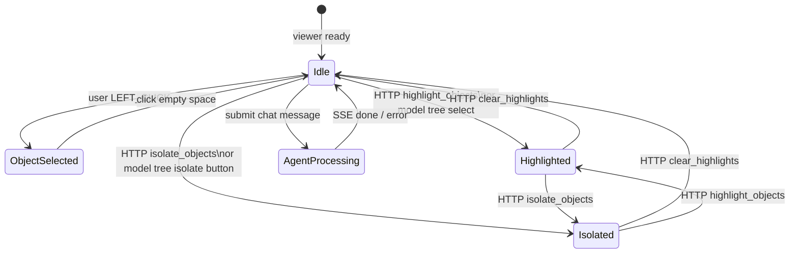

### State Consumers

| State field | Set by | Read by |
|------------|--------|---------|
| `selectedObjectId` | CesiumJS pick callback | `fetchAndRenderProperties` |
| `selectedTag` | CesiumJS pick callback | (currently unused in UI) |
| `highlightedObjectIds` | `http_command_client.ts` / `model_tree.ts` | StyleEngine (indirectly) |
| `isolatedObjectIds` | `http_command_client.ts` / `model_tree.ts` | StyleEngine (indirectly) |
| `auditLog` | Nothing (gap — see §16) | `renderAuditPanel` |
| `isAgentProcessing` | `main.ts` chat handler | submit button `disabled` |
| `agentChatMessages` | Nothing (gap — DOM used directly) | Nothing |

---

## 7. CesiumJS Integration

### Viewer Lifecycle

```
initCesiumViewer(containerId, tilesetPath, onObjectSelected)
  │
  ├── new Cesium.Viewer(containerId, { ...minimal options })
  │     scene3DOnly: true
  │     all stock UI widgets disabled
  │     skyBox, skyAtmosphere, baseLayer: false
  │     background: Color(0.12, 0.12, 0.16)
  │
  ├── Cesium3DTileset.fromUrl(tilesetPath)
  │     → viewer.scene.primitives.add(tileset)
  │     → viewer.zoomTo(tileset)       ← initial camera fit
  │     → tilesetRef.tileset = tileset
  │     → tileset.style = buildHighlightStyle([], null)  ← default style
  │
  ├── tileset.tileVisible.addEventListener(...)
  │     → iterates featuresLength per tile
  │     → populates featureIdToObjectId + objectIdToFeatureId
  │
  ├── screenSpaceEventHandler.setInputAction(LEFT_CLICK)
  │     → scene.pick() → Cesium3DTileFeature
  │     → getProperty("object_id") [primary]
  │     → node.extras fallback [secondary]
  │     → onObjectSelected(objectId, tag)
  │
  └── returns TileGraphViewer interface
        { viewer, tilesetRef, featureIdToObjectId, objectIdToFeatureId,
          highlightObjects, clearHighlights, isolateObjects,
          focusCameraOn, showBoundingBoxes }
```

### Tile Streaming Flow

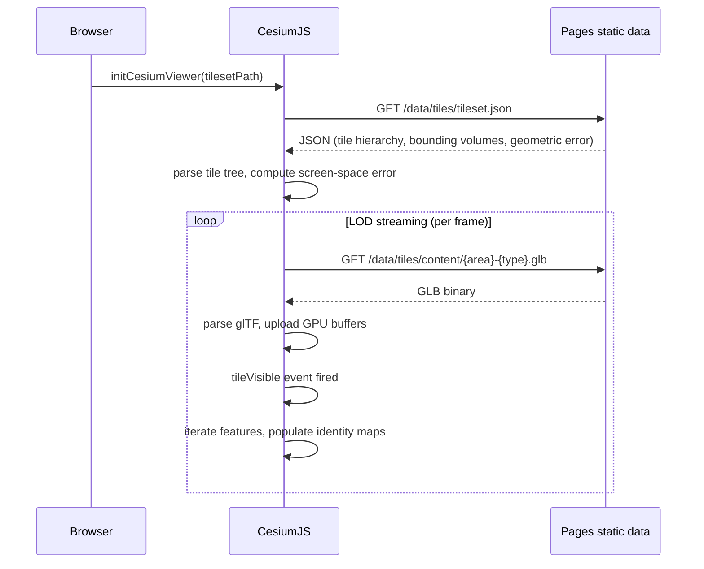

**LOD and culling:** CesiumJS computes screen-space error (SSE) per tile each frame. Tiles outside the frustum are culled. Tiles with SSE below the threshold are skipped. The Rust pipeline sets geometric error as `diagonal * 0.05` (min 0.5m) for leaf tiles and `diagonal * 1.0` for area nodes — these drive when tiles load and unload.

---

## 8. 3D Tiles Integration

### Tileset Structure

`tileset.json` is a two-level hierarchy: root → area nodes → leaf content tiles. The viewer loads it from `/data/tiles/tileset.json`; each content URI points to a GLB under `public/data/tiles/content`.

```json
{
  "asset": { "version": "1.1" },
  "root": {
    "boundingVolume": { "box": [cx, cy, cz, hx, 0, 0, 0, hy, 0, 0, 0, hz] },
    "geometricError": 150.0,
    "children": [
      {
        "boundingVolume": { "box": [...] },
        "geometricError": 50.0,
        "children": [
          {
            "boundingVolume": { "box": [...] },
            "geometricError": 2.5,
            "content": { "uri": "content/area-a-piping.glb" }
          }
        ]
      }
    ]
  }
}
```

Coordinate system: right-handed Y-up (glTF / 3D Tiles convention). Units: meters.

### GLB Content

Each GLB encodes a batch of objects of one class within one area (e.g., `area-a-piping.glb`). Every mesh primitive carries:

- `_FEATURE_ID_0` vertex attribute — a `u32` per vertex, all equal within a primitive, uniquely identifying the feature within the tile
- `EXT_mesh_features` extension — declares the feature ID attribute
- `node.extras` — engineering metadata attached to each glTF node:

```json
{
  "name": "PUMP-P-10101",
  "extras": {
    "object_id": "obj_<32hex>",
    "tag": "P-10101",
    "class": "Pump",
    "system": "SYS-COOLING-A",
    "feature_id": 1201
  }
}
```

### Feature Mapping

`tile_feature_map.json` is a lookup table produced by the Rust pipeline (`tilegraph-gltf`) that maps `feature_id` values to `object_id` values across all tiles. The viewer also builds this map in-memory from the `tileVisible` event as tiles stream in.

```json
{
  "tiles": {
    "area-a-piping": {
      "1200": "obj_abc123...",
      "1201": "obj_def456..."
    }
  }
}
```

### Object Identity Chain

```
source_tag ("P-10101")
  → object_id = "obj_" + SHA-256("synth:" + source_tag)[0..16] as hex
    → feature_id (assigned by tilegraph-gltf during GLB build)
      → tile_id (GLB filename, e.g. "area-a-piping")
        → glTF node index (position in nodes array)
```

Every identity level is preserved across all stores. The `object_id` is the stable cross-system key.

---

## 9. Feature Picking Architecture

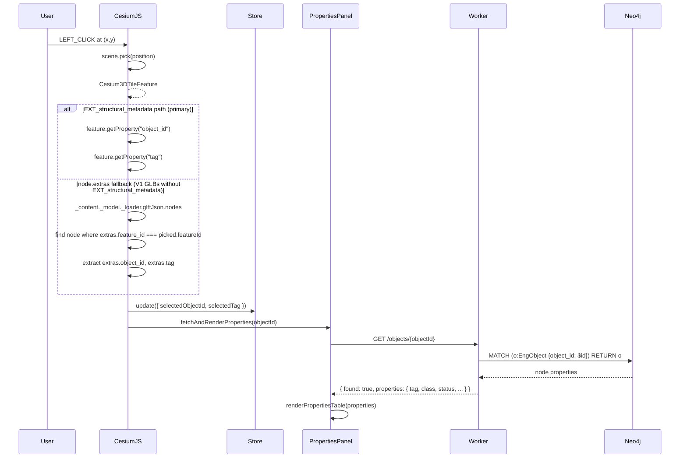

**Note on the fallback path:** The node.extras fallback uses private CesiumJS internal APIs (`_content._model._loader.gltfJson`). This is fragile and will break with CesiumJS major version updates. The correct path is to ensure all GLBs carry `EXT_structural_metadata` so `getProperty()` works reliably.

### Property Display Priority

Properties are rendered in this order (with a fallback to all remaining fields):
`tag`, `name`, `class`, `status`, `fluid`, `design_pressure_bar`, `design_temperature_c`, `power_kw`, `volume_m3`, `nominal_bore_mm`

`aabb_*` fields are always hidden from the properties panel.

---

## 10. Viewer Command Architecture

The viewer receives commands from the MCP agent by polling the Worker HTTP API. Commands are JSON objects returned by `GET /viewer/commands` and dispatched by `HttpViewerCommandClient.applyCommand()`.

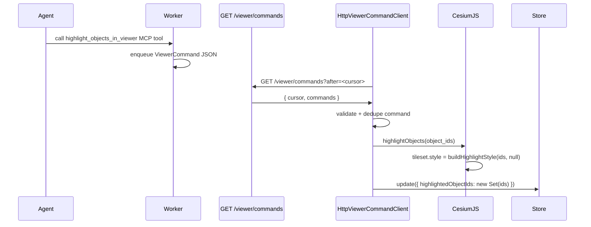

### Command Payloads

| Command type | Payload | CesiumJS effect | Store update |
|-------------|---------|----------------|--------------|
| `highlight_objects` | `{ object_ids: string[], color?: string }` | Style: matching objects lit, others dimmed | `highlightedObjectIds = new Set(ids)` |
| `isolate_objects` | `{ object_ids: string[] }` | Style: non-matching objects hidden | `isolatedObjectIds = new Set(ids)` |
| `focus_camera` | `{ object_ids: string[] }` | `zoomTo(tileset)` (**stub — see §16**) | none |
| `show_bounding_boxes` | `{ object_ids: string[] }` | `tileset.debugShowBoundingVolume = true` | none |
| `clear_highlights` | `{}` | Default style restored | `highlightedObjectIds = {}`, `isolatedObjectIds = null` |
| `create_issue_marker` | `{ object_id, title, severity }` | `console.log` only (**stub — see §16**) | none |

### Highlight Implementation

All object visibility and color is driven by a single `Cesium3DTileStyle` applied to the entire tileset. The style uses the per-feature `object_id` property to conditionally apply colors:

```typescript
// Isolation mode: show only matching objects
new Cesium3DTileStyle({
  show: `Boolean(['obj_abc','obj_def'].indexOf(String(${object_id})) >= 0)`,
  color: {
    conditions: [
      ["['obj_abc','obj_def'].indexOf(String(${object_id})) >= 0", "color('#00CCFF', 1.0)"],
      ["true", "color('#555555', 0.0)"]
    ]
  }
})
```

This approach requires that GLB features expose `object_id` as a queryable property via `EXT_mesh_features` or `EXT_structural_metadata`. The style engine evaluates per feature at render time — no JavaScript iteration over objects.

---

## 11. REST API Integration

All REST calls go to the Cloudflare Worker (`VITE_MCP_REST_URL`).

### POST /chat

**Purpose:** Submit a user query to the Claude agent loop. Returns a Server-Sent Events stream.

**Caller:** `sendAgentMessage()` in `claude_client.ts`

**Request:**
```json
{ "message": "Find all pumps connected to LINE-1001" }
```

**Response (SSE stream):**
```
data: {"type":"chunk","text":"Looking up LINE-1001..."}
data: {"type":"chunk","text":" Found 3 connected pumps."}
data: {"type":"done","turns":4,"tool_calls":["search_object_by_tag","query_connected_components","highlight_objects_in_viewer"],"session_id":"sess_abc"}
```

Chunk types: `chunk` (text fragment), `done` (agent finished, includes tool call summary), `error` (failure).

The client supports `AbortController` for mid-stream cancellation.

### GET /hierarchy

**Purpose:** Fetch the Area → System → Line → Equipment tree for the Model Tree panel.

**Caller:** `initModelTree()` in `model_tree.ts`

**Response:**
```json
[
  {
    "id": "obj_area_a",
    "tag": "AREA-A",
    "name": "Processing Area A",
    "class": "Area",
    "children": [
      {
        "id": "obj_sys_cooling",
        "tag": "SYS-COOLING-A",
        "class": "System",
        "objectIds": ["obj_abc123", "obj_def456"],
        "children": []
      }
    ]
  }
]
```

### GET /objects/:id

**Purpose:** Fetch all Neo4j properties for an engineering object by `object_id`.

**Caller:** `fetchAndRenderProperties()` in `properties_panel.ts`

**Response:**
```json
{
  "found": true,
  "properties": {
    "object_id": "obj_abc123...",
    "tag": "P-10101",
    "class": "Pump",
    "status": "Active",
    "fluid": "Water",
    "design_pressure_bar": 10.0,
    "power_kw": 22.0,
    "tile_id": "area-a-equipment",
    "feature_id": 1201
  }
}
```

### GET /viewer/commands

**Purpose:** Fetch queued viewer commands generated by MCP tools. The viewer calls this endpoint repeatedly and passes the last seen cursor as `after`.

**Caller:** `HttpViewerCommandClient` in `http_command_client.ts`

**Request:**
```
GET /viewer/commands?after=41
```

**Response:**
```json
{
  "cursor": "42",
  "commands": [
    {
      "id": "42",
      "timestamp": "2026-06-02T10:00:00Z",
      "command": {
        "type": "highlight_objects",
        "object_ids": ["obj_abc123"],
        "color": "agent_highlight"
      }
    }
  ]
}
```

The endpoint is read-only from the browser perspective. Command creation remains inside the Worker/MCP tool handlers.

### GET /health

**Purpose:** Worker health check — not called by the viewer but useful during development.

---

## 12. HTTP Command Polling Architecture

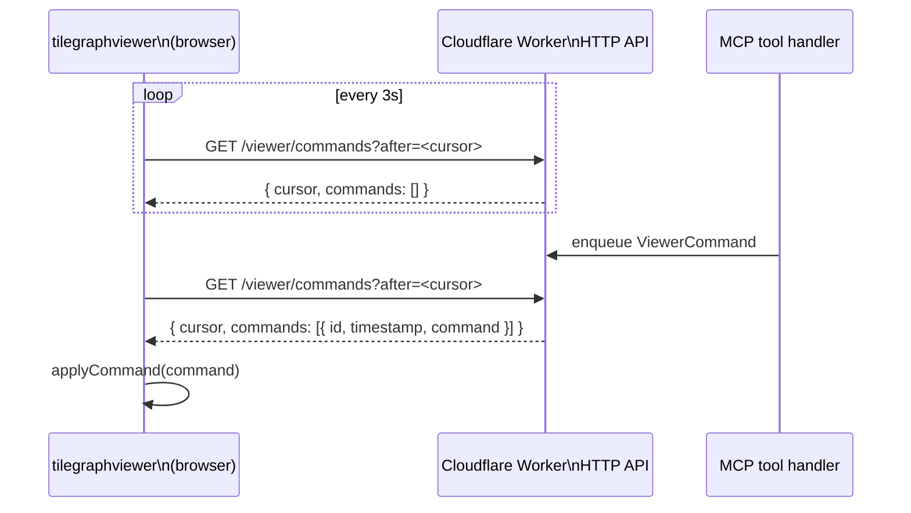

### Connection Lifecycle

`main.ts` initializes Cesium first, then starts command polling through `startOptionalCommandPolling()`. HTTP polling errors are non-fatal: the viewer keeps rendering the static 3D Tiles hierarchy from `/data/tiles`, and only agent-issued viewer commands are unavailable while the API is unreachable. `HttpViewerCommandClient` polls every 3 seconds, sends the last cursor as `after`, and deduplicates command IDs to avoid replaying repeated responses.

### Command Queue Endpoint

The Worker command endpoint is expected to return queued command envelopes:

```json
{
  "cursor": "42",
  "commands": [
    {
      "id": "42",
      "timestamp": "2026-06-02T10:00:00Z",
      "command": { "type": "highlight_objects", "object_ids": ["obj_abc123"] }
    }
  ]
}
```

The client also tolerates direct command arrays for local prototypes, but the production shape should include stable `id` or `sequence` values and a response cursor.

---

## 13. Model Tree Architecture

The Model Tree represents the engineering object hierarchy loaded from `GET /hierarchy`.

```
Area (AREA-A, AREA-B)
  └── System (SYS-COOLING-A, SYS-PROCESS-A)
        └── Line (LINE-1001, LINE-1002)
              └── Equipment (P-10101: Pump, V-10101: Valve, ...)
```

Each tree node carries an `objectIds` array — the list of `object_id` values for all engineering objects within that subtree. This array powers the isolate and highlight actions.

### Tree Interaction

| User action | Effect in CesiumJS | Effect in store |
|------------|-------------------|-----------------|
| Click node label | `highlightObjects(objectIds)` | `highlightedObjectIds = new Set(ids)` |
| Click ⊡ isolate button | `isolateObjects(objectIds)` | `isolatedObjectIds = new Set(ids)` |
| Click ▶ toggle | expand/collapse children | none |

The tree is rendered as static HTML via `renderTree()` — no virtual DOM. Event delegation uses `querySelectorAll` after each render.

---

## 14. Object Identity Architecture

Object identity is the central concern of the entire platform. Every system that touches an engineering object — the Rust pipeline, Neo4j, the spatial index, the 3D Tiles content, and the viewer — uses `object_id` as the canonical key.

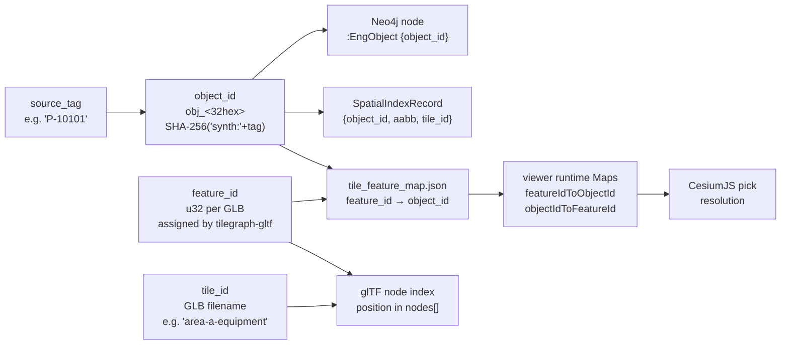

### Identity Table

| Identifier | Format | Source | Use |
|-----------|--------|--------|-----|
| `object_id` | `obj_<32 hex chars>` | SHA-256(adapter + source_tag) | Cross-system stable key |
| `tag` | `P-10101`, `V-1001A` | Engineering tag from source | Human-readable lookup |
| `feature_id` | `u32` (e.g. `1201`) | tilegraph-gltf (per GLB) | CesiumJS feature picking |
| `tile_id` | `area-a-equipment` | tilegraph-tiles | Locates the GLB file |
| `gltf_node_index` | `int` | glTF nodes array position | Internal GLB reference |
| `source_id` | adapter-specific | Source adapter | Reverse mapping to source |

**Why object_id dominates:** Visual mesh identity (triangle groups, draw calls) is volatile — it changes when geometry is regenerated, batching changes, or instancing is applied. `object_id` is stable across pipeline rebuilds because it is derived deterministically from the engineering tag. The viewer's command API, the Neo4j graph, and the MCP tools all reference `object_id`, never mesh-level identifiers.

---

## 15. Audit Panel Architecture

The Audit Panel displays the last 5 MCP tool calls from the current agent session.

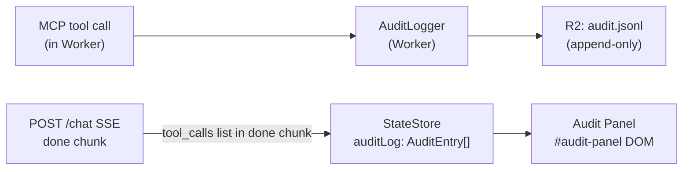

**Current gap:** The `done` SSE chunk includes `tool_calls: string[]` (tool names only). The `AuditEntry` type in the store requires `{ timestamp, tool_name, input_summary, output_summary, duration_ms }`, but the `done` chunk only provides names. As a result, `auditLog` in the store is never populated and the Audit Panel always shows "No tool calls yet."

The `audit.jsonl` file in R2 contains the full audit records written by the Worker's `AuditLogger`, but the viewer does not fetch it.

---

## 16. Current State Assessment

### Implemented

| Feature | Location | Notes |
|---------|----------|-------|
| Cesium viewer init | `cesium_init.ts:64` | All stock UI disabled, dark background |
| 3D Tiles streaming | `cesium_init.ts:92` | Loads from `/data/tiles/tileset.json` |
| Feature map population | `cesium_init.ts:100` | tileVisible event, both maps populated |
| Feature picking | `cesium_init.ts:123` | Dual-path (EXT + extras fallback) |
| Style-based highlighting | `cesium_init.ts:23` | buildHighlightStyle() with conditions |
| Style-based isolation | `cesium_init.ts:158` | show condition hides non-matching |
| HTTP command client | `http_command_client.ts` | Polls `/viewer/commands` every 3s |
| All command handlers | `http_command_client.ts` | 6 viewer commands |
| Agent SSE client | `claude_client.ts` | AbortController, streaming |
| Model tree | `model_tree.ts` | Fetch, render, expand, isolate |
| Properties panel | `properties_panel.ts` | Priority field order, hides aabb_ |
| Audit panel rendering | `main.ts:112` | Renders last 5 from store.auditLog |
| Custom state store | `store.ts` | Minimal pub/sub, no framework |
| Cloudflare Pages deployment | `vite.config.ts` | vite-plugin-cesium, dist/ |

### Partially Implemented

| Feature | Location | Gap |
|---------|----------|-----|
| `focusCameraOn` | `cesium_init.ts:163` | Ignores `objectIds` parameter; always zooms to full tileset. Needs AABB lookup per object_id and `viewer.camera.flyToBoundingSphere()`. |
| `showBoundingBoxes` | `cesium_init.ts:168` | Sets `debugShowBoundingVolume` on the entire tileset, not per-object. Needs per-feature conditional style or entity-based rendering. |
| Audit log population | `main.ts`, `store.ts` | `done` SSE chunk provides tool names but not full `AuditEntry` data. Store `auditLog` is never written. |
| Feature picking (fallback) | `cesium_init.ts:137` | Uses private CesiumJS internals (`_content._model._loader`). Brittle; breaks on CesiumJS updates. |

### Missing

| Feature | Required by | Notes |
|---------|-------------|-------|
| `create_issue_marker` visual | MCP tool `create_issue_from_selection` | Currently `console.log` only. Needs a Cesium `Entity` or billboard at object AABB center. |
| Search by tag | MasterPrompt §16 | No input field or search handler exists. Needs UI + `GET /objects?tag=P-10101`. |
| Connected components visualization | MasterPrompt §16 | Highlighting graph-connected objects as a distinct color. |
| P&ID / document links display | MasterPrompt §16 | No document panel exists. |
| Object focus per AABB | `focusCameraOn` stub | Need AABB from Neo4j properties → `BoundingSphere` → `camera.flyTo`. |
| Audit log full data | `auditLog` state | Full `AuditEntry` (timestamp, input/output summary, duration) needs to flow through SSE. |
| Session persistence | agent chat | Messages are lost on page reload. `agentChatMessages` state is never read. |
| `agentChatMessages` from store | `main.ts` | DOM is mutated directly; store field is never read. Should be the source of truth. |

### Technical Debt

| Item | Location | Risk |
|------|----------|------|
| Private Cesium API in fallback | `cesium_init.ts:137` | Breaks on any Cesium major version update |
| Duplicate feature maps | `cesium_init.ts:16-17` | Module-level exports shadow `TileGraphViewer` instance maps — two sources of truth |
| DOM mutation in agent chat | `main.ts:50-56` | Bypasses store; `agentChatMessages` state is vestigial |
| No React/framework | All UI | Manageable at current scale; becomes maintenance burden as UI grows |
| `focusCameraOn` ignores params | `cesium_init.ts:163` | Silent functional gap; callers believe camera moves to object |
| No error boundary for tileset | `cesium_init.ts:118` | `catch` only logs; viewer continues with no tiles and no user feedback |
| `color` param ignored in highlight | `cesium_init.ts:148` | Agent can specify color but it is always `#00CCFF` |

### Recommended Refactoring (Priority Order)

1. **Fix `focusCameraOn`**: Accept AABB from the store or fetch from `/objects/:id`, compute `BoundingSphere`, call `camera.flyToBoundingSphere`.
2. **Remove private API fallback**: Ensure all GLBs carry EXT_structural_metadata. Remove the `_content._model._loader` code path.
3. **Deduplicate feature maps**: Remove module-level exports; route all consumers through the `TileGraphViewer` instance.
4. **Populate audit log**: Extend the `done` SSE chunk to include full `AuditEntry` data, or open a separate SSE stream for audit events.
5. **Implement `create_issue_marker`**: Add a Cesium `Entity` billboard at the target object's AABB center.
6. **Add tag search input**: Add a text field to the sidebar, call `GET /objects?tag=<input>`, highlight result.

---

## 17. Future Architecture

### Phase 1 — Feature Picking (current)

Feature picking resolves `feature_id → object_id → properties`. All core picking machinery is implemented.

### Phase 2 — Property Query Enhancement

- AABB-based camera focus per object
- Document / P&ID links panel
- Search by tag
- Multi-select (shift-click)

### Phase 3 — Graph Visualization

- Show connected component graph overlay (line segments between related objects)
- Upstream / downstream path highlighting (distinct colors per flow direction)
- Cycle detection display

### Phase 4 — System Isolation

- Isolation mode with system boundary overlay
- Full-system camera fit with padding
- Isolation state persisted across agent turns

### Phase 5 — AI-Assisted Investigation Workflow

- Issue marker creation with severity and description
- Agent session persistence (reload-safe)
- Full audit log panel with input/output inspection
- Multi-turn context display

### Phase 6 — Industrial Digital Twin Viewer

- Measurement tool
- Clipping planes (cross-section)
- Viewpoints (named camera positions)
- P&ID overlay panel
- Change comparison (diff mode)
- Custom LOD profiles per area

### Future Architecture Diagram

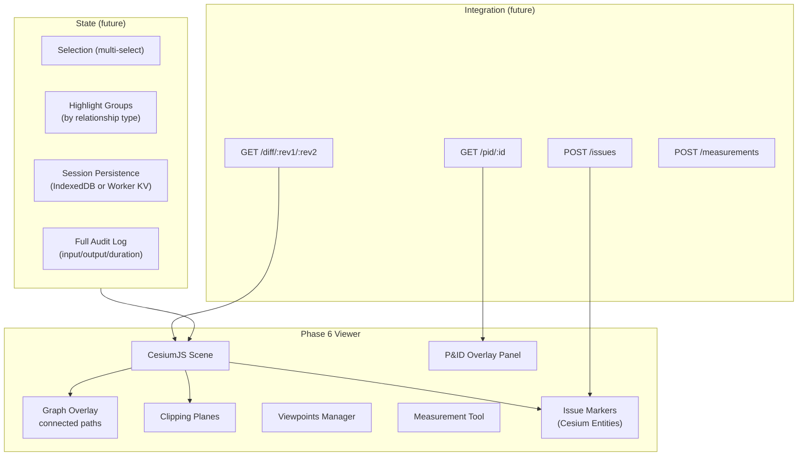

---

## 18. Performance Considerations

### Large Model Loading

The current synthetic plant (~200 objects) loads comfortably in a single request cycle. At production scale (10,000–100,000 objects across dozens of GLBs), the `tileVisible` feature map population loop becomes a bottleneck. At that scale, prefer fetching precomputed `tile_feature_map.json` from `/data/tiles/metadata` on startup rather than iterating features as they stream in.

### Style Condition Scalability

The `buildHighlightStyle()` generates a condition list with one entry per highlighted object ID. This list is embedded in a JavaScript expression evaluated per feature per frame by CesiumJS. At >500 highlighted objects, this becomes measurable. Alternatives: use a `batch table` property lookup, or a texture-based feature color map (3D Tiles 1.1 `EXT_structural_metadata` property tables).

### Tile Streaming

CesiumJS's 3D Tiles streaming is LOD-aware: far tiles load at lower resolution, near tiles refine. The geometric error settings from the Rust pipeline (`diagonal * 0.05` for leaves, `diagonal * 1.0` for areas) control this. For dense industrial models, tuning `maximumScreenSpaceError` on the tileset is important: lower values force earlier refinement (sharper) at the cost of more simultaneous requests.

### Command Polling Scalability

The HTTP command endpoint is simple and predictable for the current single-user portfolio context. For multi-user scenarios, commands must be partitioned by session ID and the polling interval should use cursor-aware long polling or per-session command queues to avoid unrelated users seeing each other's viewer commands.

### Memory Management

The `featureIdToObjectId` and `objectIdToFeatureId` Maps grow as tiles stream in and are never evicted. For large models this could exceed 100MB. The correct approach is to let CesiumJS manage tile lifecycle (tiles unload when not visible) and rebuild the maps lazily or maintain a bounded LRU cache.

### Cloudflare Edge

Cloudflare Pages serves the viewer bundle and `public/data` tile assets from edge nodes globally with no configuration. The Worker (MCP, REST, command polling) runs in a region closest to the user — Neo4j Aura is a fixed endpoint and adds latency for graph queries.

---

## 19. Security Model

### Read-only Viewer

The viewer has no write path to any data store. It sends user messages to `POST /chat` (which executes in the Worker, not the browser) and receives commands from `GET /viewer/commands`. It cannot modify the graph, modify tiles, or access the Anthropic API key.

### MCP Authorization

All sensitive operations (Neo4j queries, Anthropic API calls) occur in the Cloudflare Worker. The Worker's secrets (`NEO4J_PASSWORD`, `ANTHROPIC_API_KEY`) are set via `wrangler secret put` and are never exposed to the browser.

Optional: add Cloudflare Access in front of `/chat` and MCP endpoints to restrict usage to authenticated users.

### Viewer Command Validation

Commands received from `GET /viewer/commands` are parsed from JSON. The `HttpViewerCommandClient` uses TypeScript discriminated unions for command types and ignores unknown commands. No command can cause the viewer to write data — all effects are local style changes (`tileset.style`) or console logs.

### Static Tile Data

The Pages static tile data is public-read by design. CesiumJS fetches tiles directly from `/data/tiles/...` on the same origin. The tile data contains no PII — only engineering object geometry and synthetic metadata.

### Audit Logging

Every MCP tool call is audit-logged by the Worker's `AuditLogger` to `audit.jsonl` in R2. This log is append-only and is not modified by the viewer. The viewer displays a subset (last 5 entries) for operator transparency.

### Session Isolation

Each `/chat` session is independent. The command queue must preserve that boundary by carrying a session cursor or viewer session ID. Without session partitioning, multiple users polling the same command queue could see the same viewer commands. This is acceptable for the single-user portfolio context but must be addressed for multi-user deployment.

---

## 20. Final Architecture Summary

### Why CesiumJS

CesiumJS is the only production-grade open-source 3D Tiles renderer with a complete JavaScript API for feature picking, styling, and tileset management. It natively understands `Cesium3DTileFeature`, `Cesium3DTileStyle`, and `EXT_mesh_features` — the exact constructs the TileGraphAgent pipeline produces. No other renderer offers this level of 3D Tiles integration without significant custom development.

### Why Cloudflare Pages

The viewer is a static SPA. Cloudflare Pages provides global CDN delivery, automatic HTTPS, Git-connected deploys, zero-config preview deployments per branch, and same-origin serving for the default `public/data` tile assets. It integrates naturally with the Worker and R2-backed platform artifacts while keeping the browser runtime simple.

### Why Static Tile Hosting

3D Tiles streaming requires direct HTTPS access from the browser. Serving the default dataset from `public/data` keeps development, Pages previews, and production deployments on the same URL shape: `/data/tiles/tileset.json`. R2 remains useful for larger externally managed datasets or Worker-side artifacts, but the viewer's default tile stream is now owned by the app's static data directory.

### Why the Viewer is Separated from MCP

The viewer is a display surface; the MCP server is the reasoning and data access layer. Keeping them separate:

1. The viewer cannot accidentally access the Anthropic API key or Neo4j credentials.
2. The MCP tools can be tested independently of the viewer.
3. The viewer can be replaced (e.g., with a native desktop viewer) without touching the MCP layer.
4. Multiple viewers (browser, mobile, AR) can consume the same Worker HTTP command contract without requiring a persistent connection.

### Why Object Identity is the Central Architectural Concern

Industrial 3D is not game 3D. In a game, a destroyed mesh disappears — that is expected. In industrial visualization, every pump, valve, and pipe segment must remain traceable to its engineering record regardless of geometry changes, pipeline rebuilds, or viewer updates.

The `object_id` is derived deterministically from the source engineering tag using SHA-256. This means:
- Running the pipeline twice produces identical `object_id` values for the same objects.
- Adding new objects does not disturb existing IDs.
- The Neo4j graph, the spatial index, the 3D Tiles feature metadata, and the viewer's runtime maps all share the same key without any synchronization protocol.
- An LLM agent can issue `highlight_objects_in_viewer` with a list of `object_id` values and be certain the viewer will correctly highlight the intended engineering objects, not arbitrary mesh primitives.

Without this identity layer, the viewer would be a pretty picture. With it, it is a queryable, commandable, auditable industrial engineering surface.
